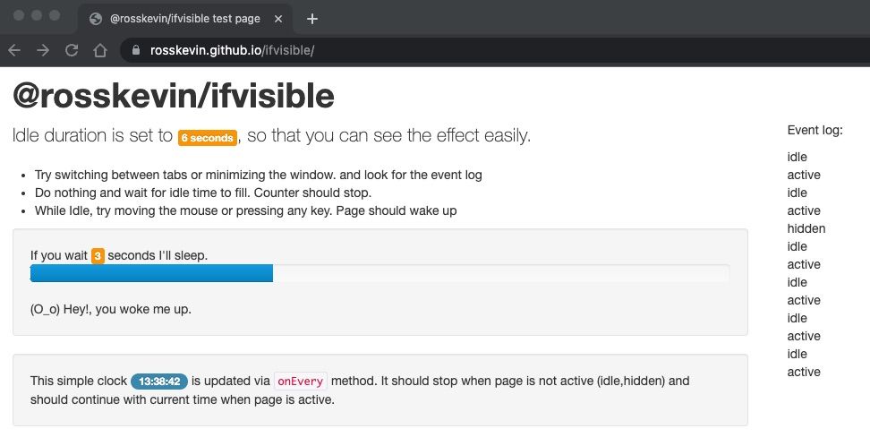

## @rosskevin/ifvisible

Crossbrowser & lightweight way to check if user is looking at the page or interacting with it.

Check out the [Demo](https://rosskevin.github.io/ifvisible/) or read below for code examples.



## Installation

From npm

```sh
npm install @rosskevin/ifvisible

# or

yarn install @rosskevin/ifvisible
```

## Examples

### Instantiation

This library provides a singleton exposed as `ifvisible` by default, but for more advancecd users, they can import the class directly for a different attachment.

```js
// import singleton global bound to the `window`
import ifvisible from '@rosskevin/ifvisible'
```

or for more advanced usage for use cases that a singleton may not be useful, you may instantiate it directly:

```js
// import the object and instantiate it yourself
import { IfVisible } from '@rosskevin/ifvisible'
window.ifvisible = new IfVisible(window, document)
```

### General

```js
// If page is visible right now
if (ifvisible.now()) {
  // Display pop-up
  openPopUp()
}

// You can also check the page status using `now` method
if (!ifvisible.now('hidden')) {
  // Display pop-up if page is not hidden
  openPopUp()
}

// Possible statuses are:
// idle: when user has no interaction
// hidden: page is not visible
// active: page is visible and user is active
```

### Handle tab switch or browser minimize states

```js
ifvisible.on('blur', function () {
  // example code here..
  animations.pause()
})

ifvisible.on('focus', function () {
  // resume all animations
  animations.resume()
})
```

### `on`

Listen for activity events such `idle` or `active`

```js
ifvisible.on('idle', function () {
  // Stop auto updating the live data
  stream.pause()
})

ifvisible.on('wakeup', function () {
  // go back updating data
  stream.resume()
})
```

### `setIdleDuration`

Default idle duration is 60 seconds but you can change it with `setIdleDuration` method

```js
ifvisible.setIdleDuration(120) // Page will become idle after 120 seconds
```

### Manually trigger status events

```js
ifvisible.idle() // will put page in a idle status

ifvisible.idle(function () {
  // This code will work when page goes into idle status
})

// other methods are
ifvisible.blur() // will trigger idle event as well
ifvisible.idle()

ifvisible.focus() // Will trigger wakeup event as well
ifvisible.wakeup()
```

### `ifvisible.off()` to remove event triggers:

```js
ifvisible.off('idle', triggeredFunction) // will remove only triggeredFunction from being tiggered on idle
ifvisible.off('idle') // will remove all events triggered on idle

// works with other events:
ifvisible.off('blur')
ifvisible.off('wakeup')
ifvisible.off('focus')
```

### `ifvisible.onEvery` to set smart intervals

Only animate a logo if the page is visible.

```js
// If page is visible run this function on every half seconds
ifvisible.onEvery(0.5, function () {
  // Do an animation on the logo only when page is visible
  animateLogo()
})
```

## Browsers

This library is intended to support _modern_ browsers. Legacy IE support (not Edge) was dropped to clean up code. Given Microsoft discontinued IE altogether, moving forward is in the best interest of maintenance. If you need legacy support, look towards the [original ifvisible.js](https://github.com/serkanyersen/ifvisible.js)

## Why fork?

The [original ifvisible.js](https://github.com/serkanyersen/ifvisible.js) library was:

- languishing with no updates
- old build system
- outdated dev depencies
- used typescript but was not strongly typed
- did not publish the typescript types (even though it was written in typescript)
- burdened with legacy code everywhere
- only a UMD module available.

In contrast this version:

- targets modern browsers only
- is strongly typed
- publishes UMD and ES bundles (will publish ESM as that comes to pass as well)
- is fully updated and maintained

NOTE: this fork was `detached` for the sole purpose of making new pull requests point to this repo instead of the original unmaintained parent.

## License

MIT.
